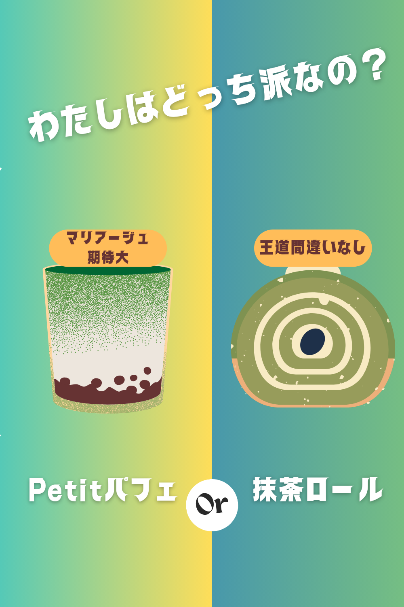
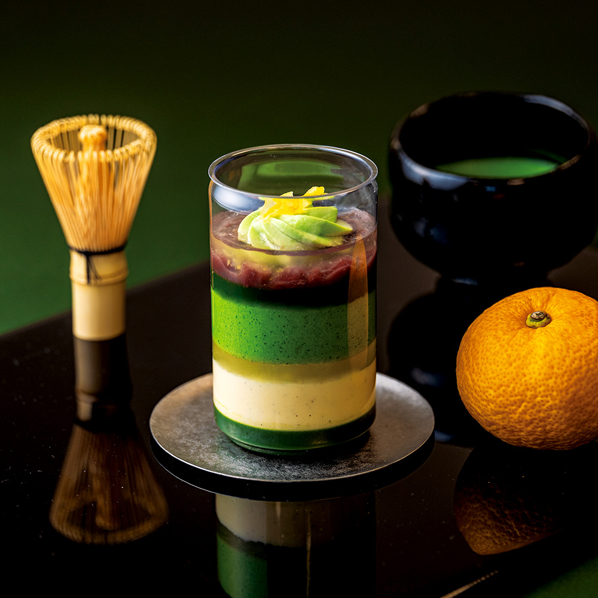
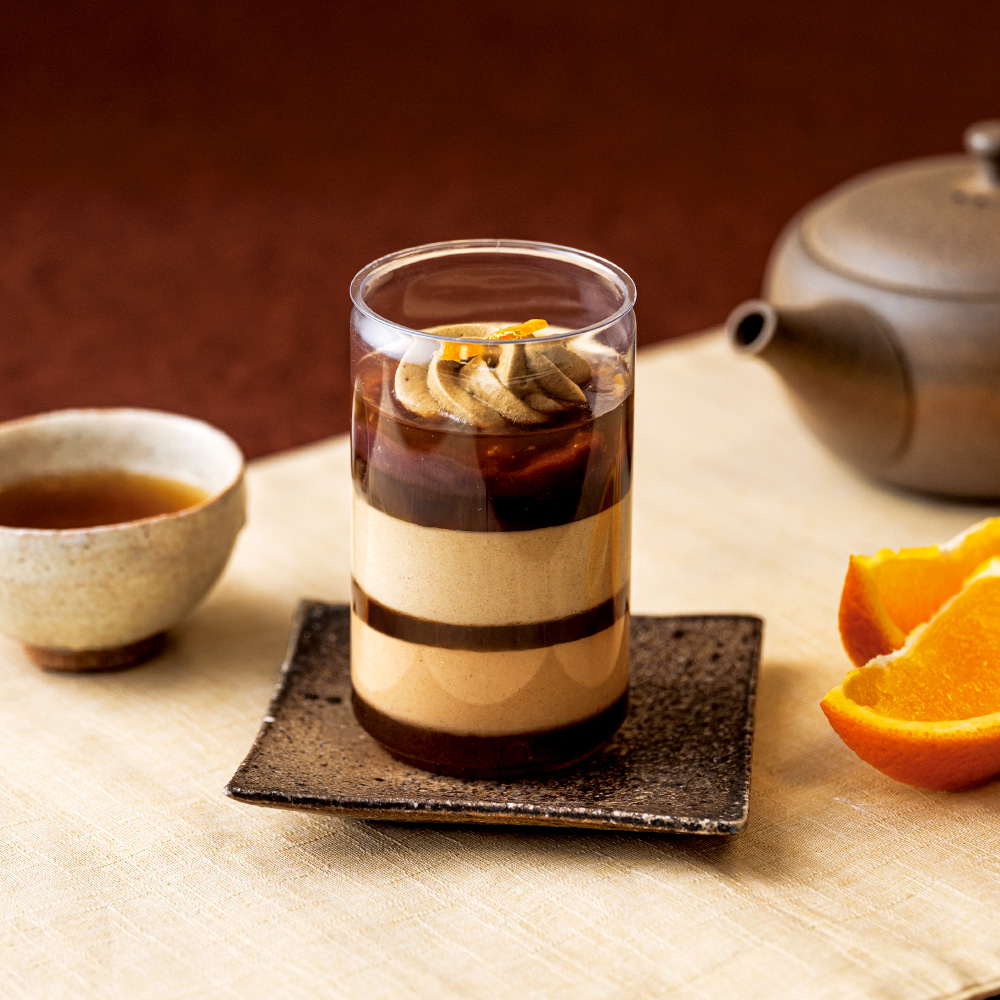
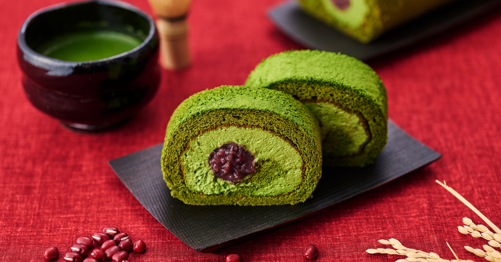

お母さんが抹茶好きなので、今年のプレゼントは「祇園辻利の抹茶スイーツ」で決まり！  
…と思ったら、選ぶのが楽しすぎて、気づけば迷いの沼にどっぷりです。  

---

## Petitパフェ どっち派？

見た目も華やかでプレゼント映え抜群の「Petitパフェ」✨  
- 王道の **抹茶** は、濃厚で深みのあるお茶の香り。  
- 香ばしい **ほうじ茶** は、やさしい甘さとほっとする味わい。  

どちらも可愛らしいサイズ感で「食べ比べ」が楽しいんです。  

  
私はパフェ派 → <a href="https://px.a8.net/svt/ejp?a8mat=45DVYB+2D5122+5E0Q+BW8O2&a8ejpredirect=https%3A%2F%2Fshop.giontsujiri.co.jp%2Fproducts%2F15001" rel="nofollow">私はパフェ派</a> 

---

## 王道の抹茶ロールケーキも外せない！

ふわふわの生地に濃厚な抹茶クリームを巻き込んだ「抹茶ロールケーキ」。  
見た目はシンプルなのに、口に入れた瞬間に広がる抹茶の香りがたまりません。  
大人数で分けやすいので、家族の集まりにもぴったりです。  

  
私はロール派 → <a href="https://px.a8.net/svt/ejp?a8mat=45DVYB+2D5122+5E0Q+BW8O2&a8ejpredirect=https%3A%2F%2Fshop.giontsujiri.co.jp%2Fproducts%2F15104" rel="nofollow">私はロール派</a> 

---

## 迷う時間も贈り物の一部

どれを選んでも、きっとお母さんが笑顔になる。  
その確信があるからこそ「どっちにしよう？」と迷う時間すら幸せに感じます。  

そして実は…もうひとつ、お父さんが好きそうな“あのお肉”にも心惹かれていて。  
それはまた次回、迷いの記録としてまとめますね😊  

---

✨ みなさんは「パフェ派」？ それとも「ロール派」？  
ぜひ心の中で選んでみてください。
