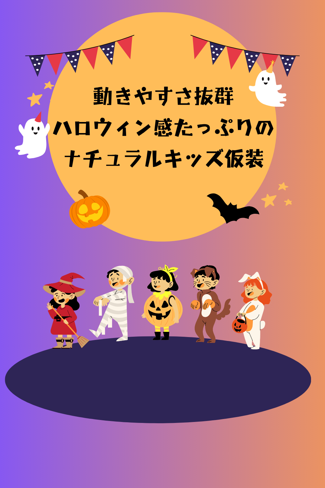

---
"ハロウィン間近！英語教室でも動きやすく、かわいく安全に🎃👦"

---

ハロウィンまであと少し！  
うちの子の英語教室でも、毎年ちょっとした仮装をして“トリック・オア・トリート！”を楽しんでいます👦✨  

去年はマントを着て歩いたら、途中でほどけて転びそうになったり💦  
だから今年は
「動きやすくて安全」「でもちゃんとハロウィン感がある」ものを重視しました。  

この **ハロウィンTシャツ** は、ゆったりしたシルエットで、  
デザインもシンプルで、男の子でも自然に着られるのがポイント。  

子どもが「おばけタイプがいい！」と選び、  
お家にあった黒系の短パンに、靴下はオレンジ×ブラックのボーダーをチョイス🧦  
カチューシャはテーマパーク用を流用🎀  
100円ショップでもハロウィングッズがまだあるので、週末にチェック予定です👀  

兄弟や親子でリンクコーデもでき、  
来年のイベントでも小物を変更して楽しむのもいいな🎵

そして普段着ぽいTシャツなので、当日バタバタでも着る時が楽ちんなのもGOOD👍

素敵なナチュラルキッズ仮装ができる1枚に出会えました♡

---
✨この投稿の一部にはアフィリエイトリンクが含まれています。 実際に私もチェックしているアイテムですので、ぜひ参考にしてみてください。

## 👻 ハロウィンTシャツ

👉<a href="https://hb.afl.rakuten.co.jp/ichiba/4d7a3485.730f2fa2.4d7a3486.e79b65d2/_RTLink115377?pc=https%3A%2F%2Fitem.rakuten.co.jp%2Fmusashi-sangyo%2F70018%2F&link_type=pict&ut=eyJwYWdlIjoiaXRlbSIsInR5cGUiOiJwaWN0Iiwic2l6ZSI6IjQwMHg0MDAiLCJuYW0iOjEsIm5hbXAiOiJyaWdodCIsImNvbSI6MSwiY29tcCI6ImRvd24iLCJwcmljZSI6MSwiYm9yIjoxLCJjb2wiOjEsImJidG4iOjEsInByb2QiOjAsImFtcCI6ZmFsc2V9" rel="nofollow">わたしもチェック！</a>

個人的には↑のサイトにある#02ばけ猫タイプが好きです！
ブラックのカラーでシックに自分用にしようかな。

サイトにはサイズ感や別途のアイテムとの雰囲気も画像に
掲載してくれているのでありがたい🙇

今年も子どもと一緒に大人も楽しく秋のイベントを楽しんでいきたいと思います！

また気になったものピックアップしますね🌟

---
