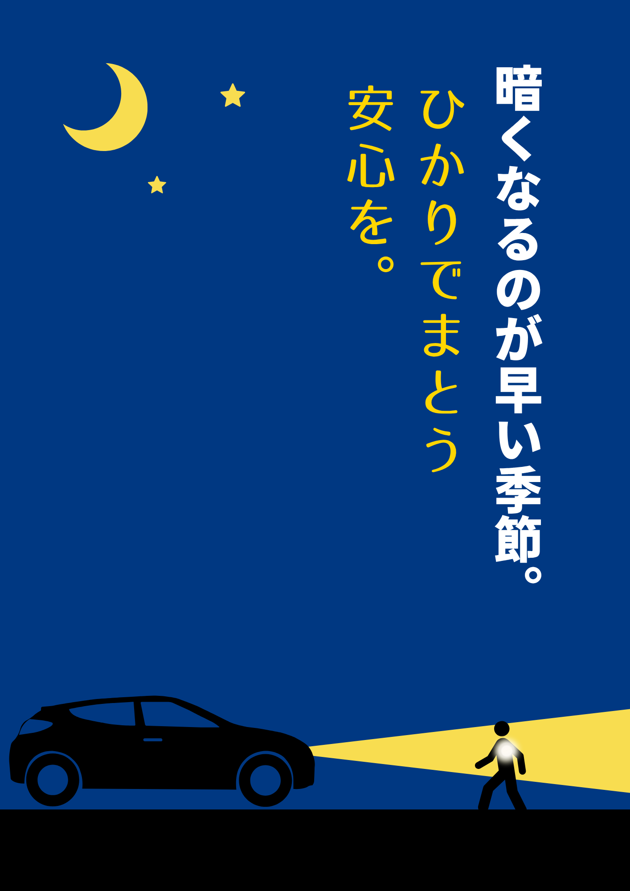

夕方の空があっという間に群青に変わる季節。  
習い事の帰り道、ランドセルの肩越しに見える小さな背中が、  
車のライトに照らされるたびに、少しドキッとする瞬間があります。  

そんな時に出会ったのが、この“ひかるふく”。  
まるで、夜道を歩く子どもたちの味方みたいな存在です🕯

---

## 🌙 私の“推し”なポイント

まず、**見た目がちゃんとかわいい。**  
反射素材の服ってどうしてもスポーティーになりがちだけど、  
これは普段着の延長みたいにナチュラルで、どんな服にも馴染みます。  

しかも、裏地が**メッシュタイプで軽くて通気性◎。**  
「寒い日も安心、でも動きやすい」が叶うんです。  

袖口がゴムになっていて、風も入りにくいし、  
自転車や徒歩送迎のときもサッと羽織れるのが本当に便利。  

---

うちの子も最初は「えっ、光るの？かっこいい！」と興味津々👦✨  
夜道でライトが当たるとふんわり光って、  
“安全”というより“特別なコート”みたいで嬉しそう。  

ちょっとした羽織ひとつで、  
親も子も少し安心して歩ける——そんな季節の相棒です🕯

---

## 🧥 私の推しアイテムはこちら！

👉 [楽天で詳しく見る（商品ページ）](https://hb.afl.rakuten.co.jp/ichiba/4d82568f.2eecf1fa.4d825690.551d8b0f/_RTLink115377?pc=https%3A%2F%2Fitem.rakuten.co.jp%2Fchildren-tsuushin%2F12229581%2F&link_type=text&ut=eyJwYWdlIjoiaXRlbSIsInR5cGUiOiJ0ZXh0Iiwic2l6ZSI6IjQwMHg0MDAiLCJuYW0iOjEsIm5hbXAiOiJyaWdodCIsImNvbSI6MSwiY29tcCI6ImRvd24iLCJwcmljZSI6MCwiYm9yIjoxLCJjb2wiOjEsImJidG4iOjEsInByb2QiOjAsImFtcCI6ZmFsc2V9)

---

✨この投稿の一部にはアフィリエイトリンクが含まれています。  
実際に私もチェックして「これいいな」と感じたアイテムを紹介しています。  

---

帰り道が少し安心になる服。  
見えるって、やっぱりあったかいですね🩵
