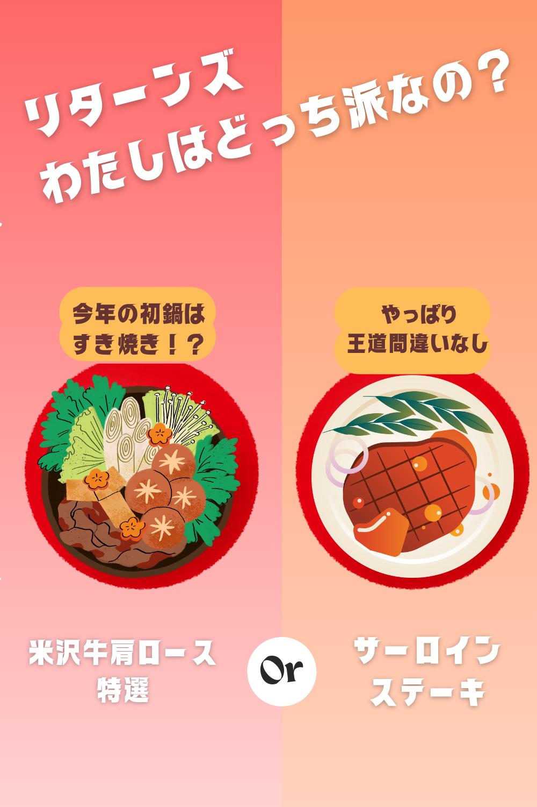
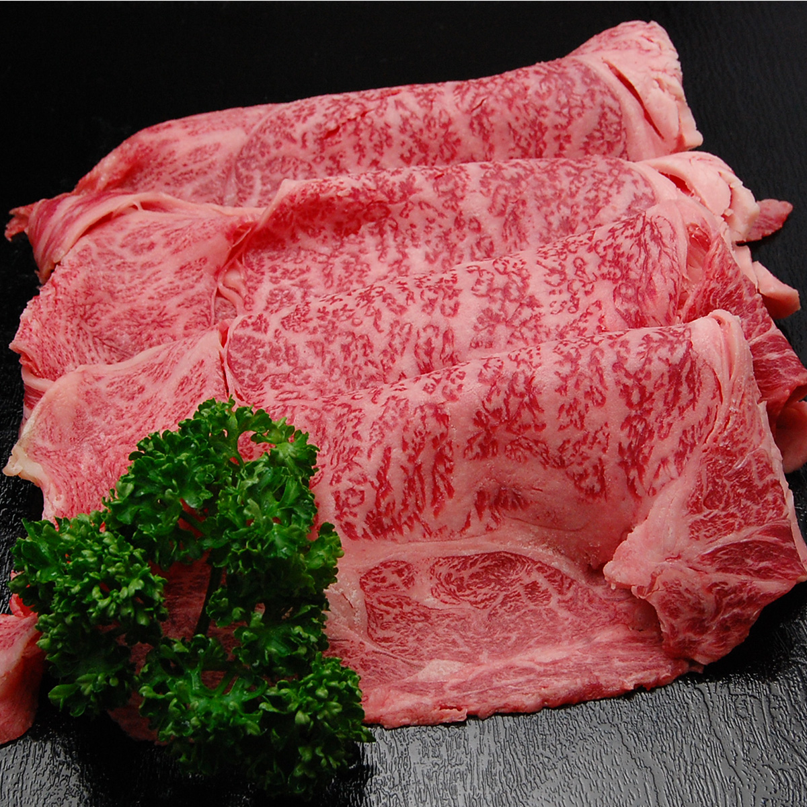
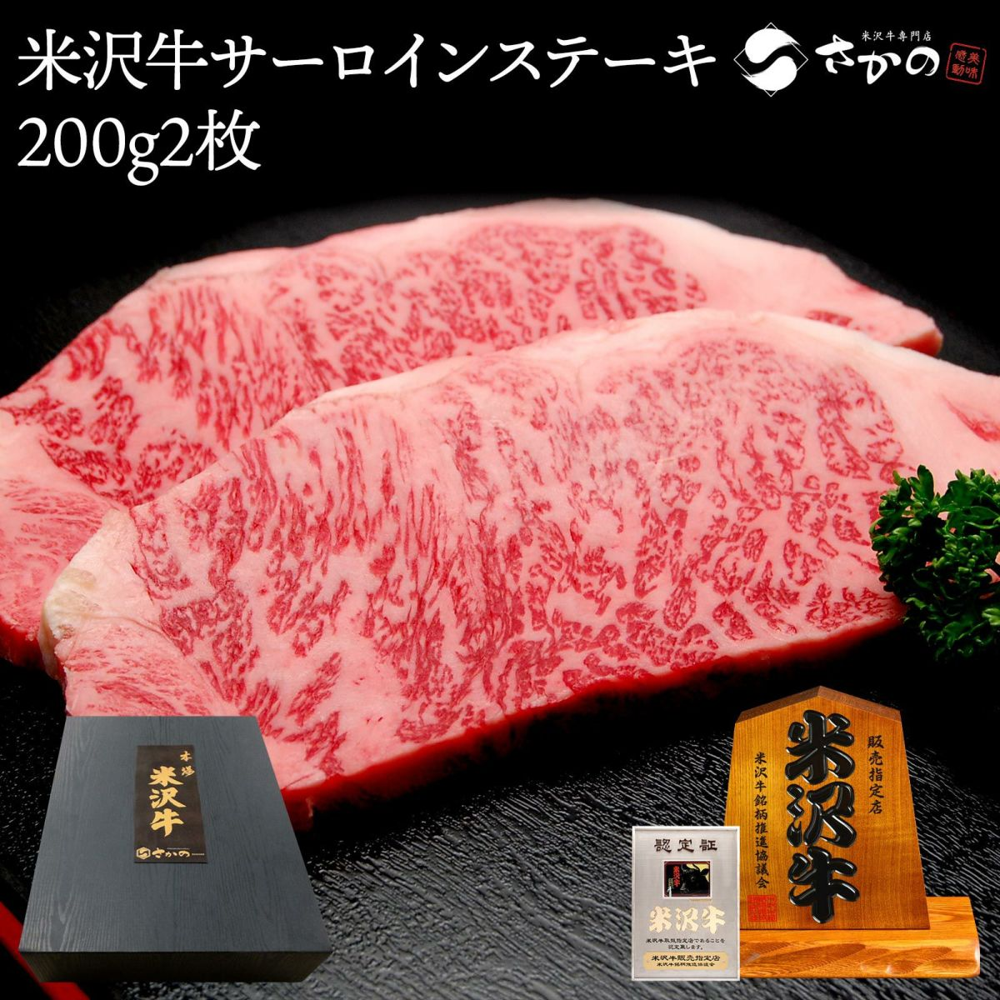

贈り物を選ぶ時間って、案外わくわくする。  
お母さんの笑顔を想像しながら、商品のページを何度も行き来してしまうこの時間が、私は好きです。

今日は「真剣に推す」会。そう、米沢牛専門店さかのさんのページにしばらく居座ってしまった私の、熱い（かつ優柔不断な）語りです。

---

## 🥘 すき焼きでほっこり派：米沢牛 方ロール特選（すき焼き用・肩ロース推し）

まずは王道の、すき焼きスタイル。  
今回惚れ込んだのは**肩に位置する上質なロース**。リブロースやサーロインにつながる部位で、きめ細かく、すき焼きにとても合うんです。

ページの写真を見ただけでわかるサシの美しさ。鍋でくぐらせた瞬間に脂がほどけて、口に含むと上品な甘みと香りがふわっと広がる。  
脂はしっかりあるのに嫌な重さがないのは、米沢の気候と肥沃な土地、長年培われてきた飼育の賜物。肩ロースは「油っこすぎず、旨みのバランスが最高」だと私は感じます。家族で囲むすき焼きの夜、あの湯気と笑い声まで想像するだけで胸があったかくなる。

<!-- ↓ A8で生成した「すき焼き用」テキストリンクをここにそのまま貼ってください（改変禁止） -->
<a href="<a href="https://px.a8.net/svt/ejp?a8mat=45DVYC+79YRQ2+242M+HUKPU&a8ejpredirect=https%3A%2F%2Fwww.yonezawa-sakano.co.jp%2Fc%2Fgr21%2Fgr203%2Fgr303%2FSKT10" rel="nofollow">あたしはすき焼き派</a>
" target="_blank" rel="nofollow">私はすき焼き派</a>
<!-- もしA8が発行する1×1トラッキング画像があれば、その画像タグもここにそのまま貼ってください -->

---

## 🥩 ステーキでどーんと行こう派：米沢牛 サーロインステーキ 200g×2

そしてもう一つの誘惑はサーロイン。  
200gが2枚というボリューム感は、贈り物としての華が違う。シンプルに塩と胡椒で焼くだけで、内側からじゅわっと溢れ出す旨みを感じることができる。ひと口ごとに「これが米沢牛だ」と実感できる濃厚さと余韻。

贈答品としても見栄えが良く、食卓での主役感が半端ない。シンプルに焼いてバターを落として食べる、フォークで切った瞬間の幸福。父世代にも刺さる一枚です。

<!-- ↓ A8で生成した「ステーキ用」テキストリンクをここにそのまま貼ってください（改変禁止） -->
<a href="<a href="https://px.a8.net/svt/ejp?a8mat=45DVYC+79YRQ2+242M+HUKPU&a8ejpredirect=https%3A%2F%2Fwww.yonezawa-sakano.co.jp%2Fc%2Fgr21%2Fgr39%2Fgr141%2FSTS202" rel="nofollow">あたしはステーキ派</a>
　" target="_blank" rel="nofollow">私はステーキ派</a>
<!-- 同様にA8のトラッキング画像がある場合はここに貼る -->

---

## 贈り物に込めるもの

正直言って、どちらを選んでも「ありがとう」が一番伝わる贈り物だと思う。  
・すき焼きは、みんなで鍋を囲む幸せそのもの。  
・ステーキは、その日を「特別」にしてくれる一枚。  

私は今日もページを行き来して、肩ロースの写真にため息をつき、サーロインの断面にまた心が揺れています。迷う時間が楽しいって、贈り物選びの隠れた魅力なんだなあ。

**プレゼント、明日までに悩みぬいて決めたい。**

---

（次回の投稿につなげる予告）  
明日の投稿では、悩み抜いた結果を“効果音：じゃらじゃらじゃら！”で発表します。  
結末は…実は、どっちも贈ることにしました！  
お母さんには祇園辻利のPetitパフェ、そしてお父さんには米沢牛 方ロール特選（すき焼き用）を。  
一言で締めるなら──「迷った時間も、贈り物のうち」。

---
