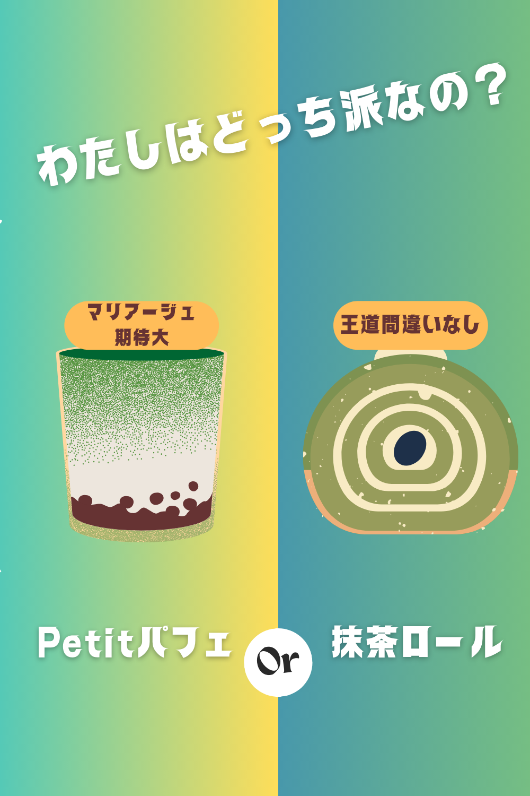

今年の敬老の日。  
お母さんが大の抹茶好きということもあって、  
「やっぱり祇園辻利しかない！」と心に決めました。  

でも……ここからが大問題。  
祇園辻利には美味しそうな抹茶スイーツが多すぎて、  
プレゼントにどれを選ぶか、迷いに迷っているんです。  

---

## 🌱 Petitパフェ（抹茶・ほうじ茶）

まずは、手軽に食べられて華やかさ満点の **Petitパフェ**。  
見た目も可愛くて、冷凍で届くのにお店クオリティそのまま。  

### 抹茶パフェ
  
濃厚な抹茶クリームが口いっぱいに広がる王道の味わい。  
「これぞ祇園辻利！」という存在感があります。  

### ほうじ茶パフェ
  
香ばしいほうじ茶が香り立つ、大人な仕立て。  
落ち着いた風味で、お母さん世代にもピッタリ。  

正直、どちらも捨てがたくて「私は抹茶派？いやいや、ほうじ茶も…」と頭を抱えるレベルです。  

👉 [私はパフェ派](https://px.a8.net/svt/ejp?a8mat=45DVYB+2D5122+5E0Q+BW8O2&a8ejpredirect=https%3A%2F%2Fshop.giontsujiri.co.jp%2Fproducts%2F15001)  
  

---

## 🍰 抹茶ロールケーキ

そしてもう一つの強敵、**宇治抹茶ロールケーキ**。  

しっとりした生地と濃厚クリーム。  
祇園辻利の抹茶をふんだんに使っていて、  
シンプルながら深みのある味わいはまさに“王道”。  

贈り物に間違いない安心感と、  
「やっぱりロールでしょ！」と言いたくなる安定感があります。  

👉 [私はロール派](https://px.a8.net/svt/ejp?ｌa8mat=45DVYB+2D5122+5E0Q+BW8O2&a8ejpredirect=https%3A%2F%2Fshop.giontsujiri.co.jp%2Fproducts%2F15104)  
  

---

## 🎁 迷う時間もプレゼントの一部

抹茶パフェか、抹茶ロールか。  
どちらを選んでも絶対に喜んでもらえるのはわかっているのに、  
ここまで悩むのは、祇園辻利のスイーツがそれだけ魅力的だから。  

敬老の日に、お母さんに「ありがとう」を伝えるプレゼント。  
迷う時間すらも、きっと素敵な思い出になるはずです。  

---

## 🍖 実はもう一つ…

実は、お父さんへのプレゼント候補もあって…。  
それが「美味しそうなお肉」なんです。  

次回はその迷いも含めて、  
「お父さんに贈るならこれ！」をまとめてみようと思います。  

どうぞお楽しみに！✨
